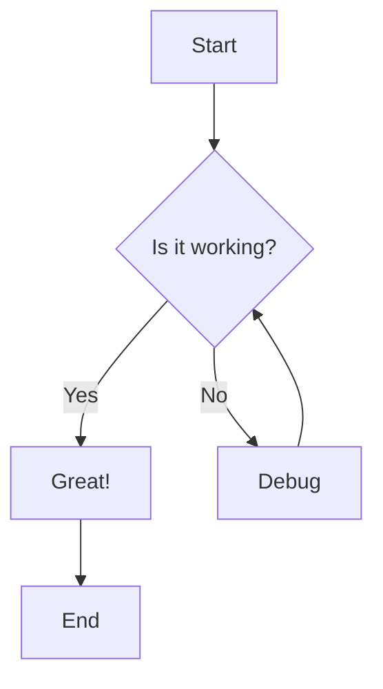

# Markdown Features

DocuHub supports extended Markdown syntax with powerful features for technical documentation.

## Basic Markdown

### Headings
````markdown
# H1 Heading
## H2 Heading
### H3 Heading
#### H4 Heading
##### H5 Heading
###### H6 Heading
````

### Text Formatting

**Bold text** using `**bold**` or `__bold__`

*Italic text* using `*italic*` or `_italic_`

***Bold and italic*** using `***text***`

~~Strikethrough~~ using `~~text~~`

### Lists

#### Unordered Lists
````markdown
- Item 1
- Item 2
  - Nested item 2.1
  - Nested item 2.2
- Item 3
````

Result:
- Item 1
- Item 2
  - Nested item 2.1
  - Nested item 2.2
- Item 3

#### Ordered Lists
````markdown
1. First item
2. Second item
3. Third item
   1. Nested item 3.1
   2. Nested item 3.2
````

Result:
1. First item
2. Second item
3. Third item
   1. Nested item 3.1
   2. Nested item 3.2

#### Task Lists
````markdown
- [x] Completed task
- [ ] Incomplete task
- [ ] Another task
````

Result:
- [x] Completed task
- [ ] Incomplete task
- [ ] Another task

### Links
````markdown
[Link text](https://example.com)
[Link with title](https://example.com "This is a title")
[Internal link](../installation)
````

[Link text](https://example.com)

### Images
````markdown


````


## Code

### Inline Code

Use `backticks` for inline code: `const value = 42;`

### Code Blocks
````markdown
```javascript
function greet(name) {
  return `Hello, ${name}!`;
}

console.log(greet('World'));
```
````

Result:
````javascript
function greet(name) {
  return `Hello, ${name}!`;
}

console.log(greet('World'));
````

### Code Blocks with Titles
````markdown
```javascript title="src/greeting.js"
export function greet(name) {
  return `Hello, ${name}!`;
}
```
````

Result:
````javascript title="src/greeting.js"
export function greet(name) {
  return `Hello, ${name}!`;
}
````

### Line Highlighting
````markdown
```javascript {2,4-6}
function calculateTotal(items) {
  let total = 0;  // This line is highlighted
  
  items.forEach(item => {  // These lines
    total += item.price;   // are also
  });                      // highlighted
  
  return total;
}
```
````

Result:
````javascript {2,4-6}
function calculateTotal(items) {
  let total = 0;  // This line is highlighted
  
  items.forEach(item => {  // These lines
    total += item.price;   // are also
  });                      // highlighted
  
  return total;
}
````

### Supported Languages

DocuHub supports syntax highlighting for many languages:

- JavaScript / TypeScript
- Python
- Java
- C / C++ / C#
- PHP
- Ruby
- Go
- Rust
- Shell / Bash
- SQL
- HTML / CSS / SCSS
- JSON / YAML
- Markdown
- And many more!

## Tables

### Basic Table
````markdown
| Feature | Supported | Notes |
|---------|-----------|-------|
| Markdown | ✅ | Full support |
| HTML | ✅ | Limited support |
| LaTeX | ❌ | Not supported |
````

Result:

| Feature | Supported | Notes |
|---------|-----------|-------|
| Markdown | ✅ | Full support |
| HTML | ✅ | Limited support |
| LaTeX | ❌ | Not supported |

### Alignment
````markdown
| Left | Center | Right |
|:-----|:------:|------:|
| Left aligned | Center aligned | Right aligned |
| Text | Text | Text |
````

Result:

| Left | Center | Right |
|:-----|:------:|------:|
| Left aligned | Center aligned | Right aligned |
| Text | Text | Text |

## Blockquotes
````markdown
> This is a blockquote.
> It can span multiple lines.

> You can also nest quotes:
> > This is a nested quote.
````

Result:

> This is a blockquote.
> It can span multiple lines.

> You can also nest quotes:
> > This is a nested quote.

## Horizontal Rules
````markdown
---
***
___
````

Result:

---

## Admonitions

### Note
````markdown
:::note
This is a note admonition.
:::
````

:::note
This is a note admonition.
:::

### Tip
````markdown
:::tip Pro Tip
Use keyboard shortcuts to work faster!
:::
````

:::tip Pro Tip
Use keyboard shortcuts to work faster!
:::

### Info
````markdown
:::info
Additional information that might be helpful.
:::
````

:::info
Additional information that might be helpful.
:::

### Warning
````markdown
:::warning
Be careful when modifying production data!
:::
````

:::warning
Be careful when modifying production data!
:::

### Danger
````markdown
:::danger Take Care
This action cannot be undone!
:::
````

:::danger Take Care
This action cannot be undone!
:::

## Advanced Features

### Tabs

Create tabbed content for different scenarios:
````markdown
import Tabs from '@theme/Tabs';
import TabItem from '@theme/TabItem';

<Tabs>
  <TabItem value="js" label="JavaScript" default>
```javascript
    console.log('Hello from JavaScript!');
```
  </TabItem>
  <TabItem value="py" label="Python">
```python
    print('Hello from Python!')
```
  </TabItem>
  <TabItem value="java" label="Java">
```java
    System.out.println("Hello from Java!");
```
  </TabItem>
</Tabs>
````

### Collapsible Sections
````markdown
<details>
  <summary>Click to expand</summary>
  
  This content is hidden until the user clicks.
  
  - You can include any Markdown here
  - Lists, code blocks, images, etc.
```javascript
  console.log('Hidden code!');
```
</details>
````

Result:

<details>
  <summary>Click to expand</summary>
  
  This content is hidden until the user clicks.
  
  - You can include any Markdown here
  - Lists, code blocks, images, etc.
````javascript
  console.log('Hidden code!');
````
</details>

### Footnotes
````markdown
Here's a sentence with a footnote[^1].

[^1]: This is the footnote content.
````

### Definition Lists
````markdown
Term 1
: Definition for term 1

Term 2
: Definition for term 2
: Another definition for term 2
````

### Emojis

You can use emojis directly or with shortcodes:

- 🚀 `:rocket:`
- ✅ `:white_check_mark:`
- ❌ `:x:`
- 📚 `:books:`
- 💡 `:bulb:`
- ⚠️ `:warning:`

## Front Matter

Add metadata to your documents using YAML front matter:
````markdown
---
sidebar_position: 1
title: Custom Page Title
description: This appears in search results
keywords: [documentation, markdown, guide]
---

# Your content starts here
````

### Common Front Matter Fields

| Field | Type | Description |
|-------|------|-------------|
| `title` | string | Page title (overrides H1) |
| `description` | string | Meta description for SEO |
| `sidebar_position` | number | Order in sidebar |
| `sidebar_label` | string | Custom sidebar text |
| `hide_title` | boolean | Hide the page title |
| `hide_table_of_contents` | boolean | Hide the TOC |
| `keywords` | array | SEO keywords |
| `image` | string | Social media preview image |

## HTML in Markdown

You can use HTML when Markdown isn't enough:
````html
<div style="background-color: #f0f0f0; padding: 20px; border-radius: 8px;">
  <h3>Custom HTML Block</h3>
  <p>You can use HTML for advanced styling.</p>
</div>
````

Result:

<div style={{backgroundColor: '#f0f0f0', padding: '20px', borderRadius: '8px', marginTop: '1rem'}}>
  <h3>Custom HTML Block</h3>
  <p>You can use HTML for advanced styling.</p>
</div>

:::warning HTML Usage
Use HTML sparingly. Stick to Markdown when possible for better maintainability.
:::

## Math Equations

DocuHub supports LaTeX math equations using KaTeX:

### Inline Math
````markdown
The formula $E = mc^2$ is famous.
````

### Block Math
````markdown
$$
\int_{-\infty}^{\infty} e^{-x^2} dx = \sqrt{\pi}
$$
````

## Diagrams with Mermaid

Create diagrams using Mermaid syntax:
````markdown

````

Result:
````mermaid
graph TD;
    A[Start] --> B{Is it working?};
    B -->|Yes| C[Great!];
    B -->|No| D[Debug];
    D --> B;
    C --> E[End];
````

### Sequence Diagrams
````mermaid
sequenceDiagram
    participant User
    participant App
    participant API
    
    User->>App: Click button
    App->>API: Send request
    API-->>App: Return data
    App-->>User: Display result
````

## Best Practices

### 1. Keep It Simple

Start with basic Markdown. Add complexity only when needed.

### 2. Use Semantic Markup

- Use headings hierarchically (H1 → H2 → H3)
- Use lists for lists, tables for tabular data
- Use code blocks for code, not screenshots

### 3. Be Consistent

- Choose one style for links, lists, emphasis
- Use the same heading case (Title Case or Sentence case)
- Maintain consistent code formatting

### 4. Optimize for Readability

- Break long paragraphs into shorter ones
- Use whitespace generously
- Add visual elements (callouts, images, tables)

### 5. Test Your Markdown

- Preview before publishing
- Check all links
- Verify code examples work
- Test on different screen sizes

## Markdown Cheatsheet

Quick reference for common syntax:
````markdown
# Heading 1
## Heading 2
### Heading 3

**bold** or __bold__
*italic* or _italic_
***bold italic***
~~strikethrough~~

[Link](url)


- List item
1. Numbered item

`inline code`

> Blockquote

---

| Table | Header |
|-------|--------|
| Cell  | Cell   |

:::note
Admonition
:::
````

## Resources

### Learn More

- [Markdown Guide](https://www.markdownguide.org/)
- [CommonMark Spec](https://commonmark.org/)
- [GitHub Flavored Markdown](https://github.github.com/gfm/)
- [Docusaurus Markdown Features](https://docusaurus.io/docs/markdown-features)

### Tools

- [Markdown Live Preview](https://markdownlivepreview.com/)
- [Tables Generator](https://www.tablesgenerator.com/markdown_tables)
- [Mermaid Live Editor](https://mermaid.live/)

## Next Steps

- [Learn about API Documentation →](../api/overview)
- [See Code Examples →](../api/examples)
- [View Writing Guidelines →](./writing-docs)

---

**Happy writing!** 📝 Now you have all the tools to create beautiful, functional documentation.